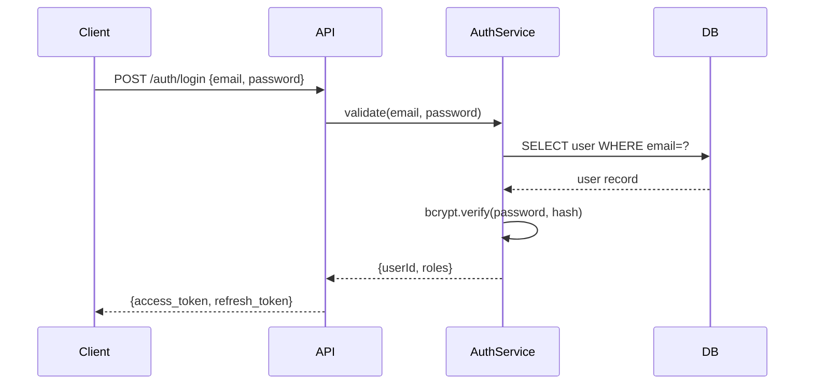
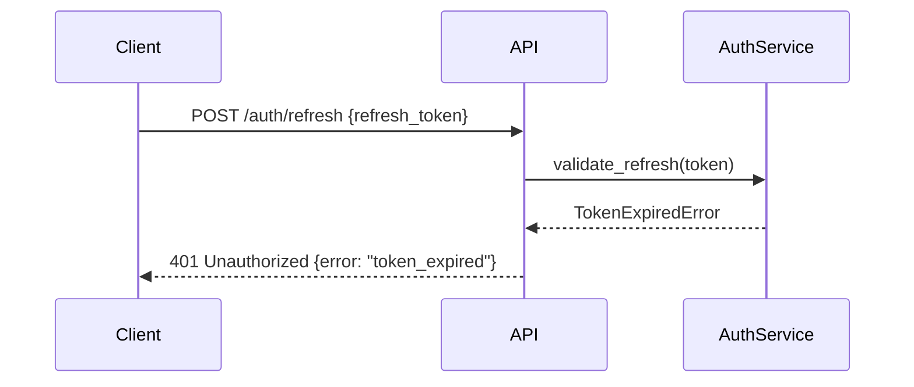

# System Design

A structured end-to-end guide for designing systems from scratch, making architecture decisions, estimating capacity, and building for scalability and reliability.

## When to Activate

- Designing a new service, platform, or system from scratch
- Writing a design document, tech spec, or RFC
- Making a technology selection or architecture decision
- Writing an Architecture Decision Record (ADR)
- Reviewing a design for scalability, reliability, or security gaps
- Planning capacity for a feature expected to handle significant load

---

## Design Process

Follow these six steps in order. Each step informs the next — skipping steps leads to rework.

1. **Clarify requirements** — Gather functional requirements (what it does), non-functional requirements (scale, latency, availability, durability), and constraints (budget, existing stack, team size, timeline).
2. **Estimate scale** — QPS, storage, bandwidth. See [Capacity Estimation](#capacity-estimation) section.
3. **Define API contracts** — What APIs does the system expose? What are the request/response shapes, authentication mechanisms, and versioning strategy? Reference the `api-design` skill for REST/gRPC conventions.
4. **Design the data model** — Define entities, relationships, access patterns, and storage technology. Choose SQL vs NoSQL based on the [Technology Selection Matrix](#technology-selection-matrix).
5. **Design components** — Produce a High-Level Design (HLD) diagram, assign service responsibilities, and define communication patterns (sync vs async).
6. **Identify bottlenecks** — Find single points of failure, scaling limits, hot partitions, and cascading failure risks before the design is locked.

### Quick Decision Framework

| Non-functional requirement | Design implication |
|----------------------------|--------------------|
| High read throughput | Read replicas, caching layer |
| High write throughput | Sharding, async writes, CQRS |
| Low latency | CDN, in-process cache, co-location |
| High availability | Multi-AZ, load balancing, circuit breakers |
| Strong consistency | Single-leader DB, distributed transactions (use carefully) |
| Eventual consistency | Event-driven, CQRS + event sourcing acceptable |

---

## Capacity Estimation

Back-of-envelope estimation before any design work. Use these numbers to size components and catch obvious scaling problems early.

### Back-of-Envelope Template

```
# Traffic
Daily Active Users (DAU): X
Requests per user per day: Y
QPS (avg) = X * Y / 86400
QPS (peak) = avg * 3x

# Storage
Data per request: Z bytes
Daily new data = QPS_avg * 86400 * Z
1 year storage = daily * 365
With replication (3x): total * 3

# Bandwidth
Inbound  = QPS * avg_request_size
Outbound = QPS * avg_response_size
```

### Example Estimation

```
# Twitter-scale write path example
DAU = 100M
Tweets per user per day = 0.5
QPS (avg) = 100M * 0.5 / 86400 ≈ 580 QPS
QPS (peak) = 580 * 3 ≈ 1,750 QPS

Tweet size = 300 bytes
Daily new data = 580 * 86400 * 300 ≈ 15 GB/day
1 year = 15 * 365 ≈ 5.5 TB
With 3x replication ≈ 16.5 TB/year
```

### Latency Reference Numbers

| Operation | Latency |
|-----------|---------|
| L1 cache | ~1 ns |
| L2 cache | ~10 ns |
| RAM read | ~100 ns |
| SSD read | ~100 µs |
| Network round trip (same DC) | ~500 µs |
| Network round trip (cross-region) | ~30–100 ms |
| HDD seek | ~10 ms |

Internalize these numbers. When someone says "just add a DB call", that is ~100 µs on SSD minimum — more if the query is complex or the DB is cross-region.

---

## High-Level Design

### Component Types

| Component | Responsibility | When to add |
|-----------|---------------|-------------|
| Load Balancer | Distribute traffic, health checks, SSL termination | Multiple app instances |
| API Gateway | Auth, rate limiting, routing, protocol translation | Public-facing APIs, microservices |
| Application Server | Business logic | Always |
| Cache (Redis/Memcached) | Reduce DB reads, session storage | Hot data, session state |
| Relational DB | ACID transactions, structured data | Most workloads |
| NoSQL DB | Flexible schema, high write throughput, time series | Specific access patterns |
| Message Queue | Async processing, decoupling, fan-out | Background jobs, event-driven flows |
| CDN | Static asset delivery, edge caching | Web apps, high-read global content |
| Object Storage (S3) | Files, images, backups | Binary data, large files |
| Search Engine (Elasticsearch) | Full-text search, complex queries | Search, log analytics |

### Diagram Conventions (text-based)

Use ASCII block diagrams when Mermaid is unavailable. Vertical lines show primary request paths; horizontal lines show async or secondary flows.

```
Client
  │
  ▼
[CDN]──────────────────────────────────┐
  │                                    │
  ▼                                  Static
[Load Balancer]                       Assets
  │
  ├──► [App Server 1]
  ├──► [App Server 2]   ──► [Cache (Redis)]
  └──► [App Server N]
              │
              ▼
       [Primary DB] ──► [Read Replica 1]
                    ──► [Read Replica 2]
```

### Adding a Message Queue

```
[App Server]
     │
     ▼
[Message Queue (Kafka/SQS)]
     │
     ├──► [Worker 1: Email notifications]
     ├──► [Worker 2: Analytics pipeline]
     └──► [Worker 3: Search indexing]
```

Decouple producers and consumers. App servers enqueue and return immediately; workers process asynchronously without blocking the request path.

---

## Low-Level Design

### Sequence Diagrams (Mermaid)

Use Mermaid sequence diagrams to describe multi-service interactions. Always show the happy path first, then error cases separately.

**Example: Authentication flow**



**Example: Token refresh error path**



### Class/Interface Design

Define interfaces at service boundaries, not at implementation boundaries. Depend on abstractions; never depend on concrete classes across module boundaries.

**UserRepository interface**

```python
from abc import ABC, abstractmethod
from typing import Optional
from uuid import UUID

class UserRepository(ABC):

    @abstractmethod
    def find_by_id(self, user_id: UUID) -> Optional["User"]:
        ...

    @abstractmethod
    def find_by_email(self, email: str) -> Optional["User"]:
        ...

    @abstractmethod
    def save(self, user: "User") -> "User":
        ...

    @abstractmethod
    def delete(self, user_id: UUID) -> None:
        ...
```

**PostgresUserRepository implementation**

```python
class PostgresUserRepository(UserRepository):

    def __init__(self, db: Session):
        self._db = db

    def find_by_id(self, user_id: UUID) -> Optional[User]:
        return self._db.query(UserModel).filter_by(id=user_id).first()

    def find_by_email(self, email: str) -> Optional[User]:
        return self._db.query(UserModel).filter_by(email=email).first()

    def save(self, user: User) -> User:
        self._db.merge(user)
        self._db.commit()
        return user

    def delete(self, user_id: UUID) -> None:
        self._db.query(UserModel).filter_by(id=user_id).delete()
        self._db.commit()
```

The service layer only imports `UserRepository`. Swapping Postgres for DynamoDB requires only a new implementation class — no changes to the service.

### State Machines

Model entities as state machines when they have a well-defined lifecycle with discrete states and transitions. Common examples: orders, subscriptions, payments, onboarding flows.

**When to use a state machine:**
- The entity has more than two states
- Transitions have side effects (send email, charge card, create record)
- Invalid transitions must be rejected

**Order lifecycle example**

| Current State | Event | Next State | Action |
|---------------|-------|------------|--------|
| PENDING | payment_confirmed | PAID | Send order confirmation email |
| PAID | items_shipped | SHIPPED | Send shipping notification |
| SHIPPED | delivery_confirmed | DELIVERED | Release funds to merchant |
| PAID | cancellation_requested | CANCELLED | Issue refund |
| SHIPPED | cancellation_requested | REFUND_PENDING | Initiate return process |
| DELIVERED | refund_requested | REFUND_PENDING | Start refund review |

Store the current state in the database. Reject any event that does not have a valid transition from the current state. Log every transition with timestamp and actor.

---

## Architecture Decision Records (ADRs)

An ADR captures the context, decision, and consequences of a significant architecture choice. Write one whenever you make a decision that would be expensive or disruptive to reverse.

### Template

```markdown
# ADR-NNNN: [Short title]

## Status
[Proposed | Accepted | Deprecated | Superseded by ADR-XXXX]

## Context
[What is the problem? What forces are at play?]

## Decision
[What have we decided to do?]

## Consequences
### Positive
- ...

### Negative
- ...

## Alternatives Considered
| Option | Pros | Cons | Reason rejected |
|--------|------|------|-----------------|
| ...    | ...  | ...  | ...             |
```

### ADR Conventions

- **File naming:** `docs/adr/0001-use-postgres-for-primary-store.md`
- **Numbering:** Sequential, zero-padded to four digits. Never renumber existing ADRs.
- **Lifecycle:** `Proposed` → `Accepted` → (`Deprecated` | `Superseded`)
- **Superseded ADRs:** Keep the file. Add a note at the top: "Superseded by ADR-0012." Link forward, never delete.
- **Write an ADR when:** changing a primary database, switching communication patterns, adopting a new framework, changing authentication strategy, or adding a new external dependency that will be hard to remove.
- **Do not write an ADR for:** library version bumps, minor refactors, tooling preferences with no architectural impact.

### Example ADR

```markdown
# ADR-0003: Use PostgreSQL for primary data store

## Status
Accepted

## Context
We need a primary relational store. The team has strong SQL expertise.
Our access patterns are mostly relational with complex join queries.
We need ACID transactions for financial operations.

## Decision
Use PostgreSQL 15 as the primary relational database.

## Consequences
### Positive
- Full ACID compliance
- Rich query planner and index types (BRIN, GIN, partial)
- Strong community and tooling ecosystem

### Negative
- Vertical scaling only for writes (mitigated with read replicas)
- Schema migrations require care at scale

## Alternatives Considered
| Option      | Pros                        | Cons                             | Reason rejected               |
|-------------|-----------------------------|----------------------------------|-------------------------------|
| MySQL 8     | Widely supported            | Weaker JSON support, less ANSI   | Team unfamiliar, fewer features |
| MongoDB     | Flexible schema             | No multi-doc ACID, weak joins    | Access patterns are relational |
| CockroachDB | Distributed SQL, geo-local  | Operational complexity, cost     | Premature for current scale   |
```

---

## Technology Selection Matrix

### SQL vs NoSQL

| Criterion | SQL (PostgreSQL) | Document (MongoDB) | Key-Value (Redis) | Column (Cassandra) |
|-----------|------------------|--------------------|-------------------|--------------------|
| ACID transactions | Full | Limited | No | Lightweight |
| Query flexibility | High (joins, aggregates) | Medium | Low | Low |
| Schema | Strict | Flexible | None | Flexible |
| Scale-out | Vertical + read replicas | Horizontal | Horizontal | Horizontal |
| Best for | Most apps, financial data | Flexible documents | Cache, sessions | High-write, time series |

**Default:** Start with PostgreSQL. Move to NoSQL only when you have a concrete access pattern that PostgreSQL cannot handle at scale.

### Sync vs Async Communication

| Pattern | Latency | Coupling | Best for |
|---------|---------|----------|----------|
| REST/gRPC (sync) | Low | Tight | Request/response, queries |
| Message queue (async) | Higher | Loose | Background jobs, fan-out, retry |
| Event streaming (Kafka) | Medium | Very loose | Audit log, real-time analytics, event sourcing |

**Rule of thumb:** If the caller needs the result to continue, use sync. If the caller only needs to know the work was accepted, use async.

### Monolith vs Microservices

| Factor | Monolith | Microservices |
|--------|----------|---------------|
| Team size | < 10 engineers | > 10 engineers with clear domain ownership |
| Deploy complexity | Low | High (orchestration required) |
| Data isolation | Shared DB (simple) | DB per service (complex) |
| Scalability | Scale whole app | Scale individual services |
| Start with | Always | Only when monolith has real pain points |

**Default:** Start with a modular monolith. Extract services only when a specific bounded context has meaningfully different scaling or deployment needs.

---

## Scalability Patterns

### Horizontal Scaling

Make services stateless so any instance can handle any request.

- Store session state in Redis, not in-process memory
- Store uploaded files in object storage (S3), not on the local filesystem
- Store configuration in environment variables or a config service
- Never use sticky sessions in a load balancer unless absolutely required

```
# Stateless service checklist
- No in-process session state
- No local file system dependencies
- Idempotent request handling (safe to retry)
- Config from environment, not hardcoded
```

### Read Replicas

Route read-heavy queries to replicas to offload the primary.

```
[App Server]
  │
  ├──[WRITE]──► [Primary DB]
  │
  └──[READ]───► [Read Replica 1]
               [Read Replica 2]
```

- Accept replication lag: reads from replicas may be slightly stale
- Use the primary for reads immediately following a write (read-your-writes consistency)
- Monitor replication lag — alert if it exceeds your SLA tolerance

### Sharding

Partition data across multiple database nodes when a single node cannot handle write throughput or storage.

- **Hash sharding:** Apply a hash function to the shard key (e.g., `user_id % N`). Provides even distribution. Use consistent hashing to reduce rebalancing cost.
- **Range sharding:** Partition by ordered key (e.g., `created_at` by month). Efficient for time-series scans. Risk: hot partitions at the current time range.
- **Directory sharding:** A lookup table maps keys to shards. Flexible but lookup table becomes a bottleneck.

**Sharding problems to plan for:**
- Cross-shard queries require scatter-gather — expensive
- Rebalancing when adding shards is operationally complex
- Unique ID generation must be shard-aware (use UUIDs or Snowflake IDs)

### CQRS (Command Query Responsibility Segregation)

Separate the write model (commands) from the read model (queries).

```
                    ┌────────────────────────┐
Write Path          │                        │   Read Path
                    │                        │
[Command] ──► [Write Model] ──► [Event Bus] ──► [Projections] ──► [Read Model]
             (normalized,                        (denormalized,
              ACID DB)                           query-optimized)
```

- **Write model:** Normalized, strongly consistent, ACID transactions
- **Read model:** Denormalized projections tailored to specific query shapes
- **Event sourcing on the write side:** Store events (facts) rather than current state; derive state by replaying events
- **Use when:** Read and write access patterns are fundamentally different, or you need audit history

### Caching Layers

| Layer | Technology | Scope | Invalidation |
|-------|-----------|-------|--------------|
| L1 | In-process LRU (e.g., `functools.lru_cache`) | Single process | TTL or restart |
| L2 | Distributed cache (Redis, Memcached) | All app instances | TTL, event-driven, write-through |
| L3 | CDN (Cloudflare, CloudFront) | Public content, global edge | Cache-Control headers, purge API |

**Cache invalidation strategies:**

- **TTL (time-to-live):** Simple, tolerates stale data. Good for reference data.
- **Write-through:** Write to cache and DB simultaneously. Cache is never stale but adds write latency.
- **Event-driven invalidation:** On write, publish an event; consumers invalidate their cache entries. Complex but accurate.
- **Cache-aside (lazy loading):** Read from cache; on miss, read from DB and populate cache. Most common pattern.

---

## Reliability Patterns

### Circuit Breaker

Prevents cascading failures when a downstream dependency degrades or fails.

**States:**
- **Closed (normal):** Requests flow through. Failures are counted.
- **Open (failing):** Circuit trips after threshold failures. Requests are rejected immediately (fast fail) without calling the downstream.
- **Half-Open (probing):** After a cooldown period, a small number of requests are allowed through. If they succeed, the circuit closes. If they fail, it reopens.

```
[App] ──► [Circuit Breaker] ──► [Downstream Service]
                │
                └── If OPEN: return fallback immediately
```

**Libraries:**
- Python: `circuitbreaker`
- Node.js: `opossum`
- Go: `gobreaker`
- Java: Resilience4j

### Retry with Exponential Backoff

```
wait = base_delay * (2 ^ attempt) + jitter
max_attempts = 3–5
```

- **Jitter:** Add random noise (±50% of computed wait) to prevent the thundering herd problem — all clients retrying simultaneously
- **Only retry idempotent operations:** GET, PUT, DELETE are safe. POST may not be unless you add idempotency keys.
- **Set a budget:** Total retry time must be less than the upstream timeout.

```python
import random
import time

def retry_with_backoff(fn, max_attempts=4, base_delay=0.5):
    for attempt in range(max_attempts):
        try:
            return fn()
        except RetryableError as e:
            if attempt == max_attempts - 1:
                raise
            wait = base_delay * (2 ** attempt) + random.uniform(0, base_delay)
            time.sleep(wait)
```

### Bulkhead

Isolate resource pools so that saturation in one consumer does not exhaust shared resources.

```
[App Server]
  │
  ├── Thread Pool A (50 threads) ──► [Payment Service]
  ├── Thread Pool B (20 threads) ──► [Inventory Service]
  └── Thread Pool C (10 threads) ──► [Recommendation Service]
```

- If the Recommendation Service hangs, Thread Pool C exhausts, but Thread Pool A and B are unaffected
- Apply bulkheads for any downstream dependency that could be slow or unreliable
- Size each pool based on expected concurrency and dependency SLA

### Graceful Degradation

Return useful (possibly stale) responses when live data is unavailable.

| Scenario | Degraded response |
|----------|------------------|
| Inventory service down | Show product listings from cache, hide real-time stock count |
| Recommendation engine down | Show static "popular items" list |
| Search service down | Disable search box, show browse-by-category fallback |
| Payment service degraded | Queue payment, confirm async, inform user |

**Implementation pattern:** Wrap dependency calls in a try/except or circuit breaker. On failure, return the last cached value or a safe default.

### Timeout Hierarchy

Always set explicit timeouts at every layer. Never rely on defaults — most frameworks default to infinite or very large timeouts.

| Layer | Recommended timeout |
|-------|-------------------|
| User-facing API (client → server) | 500 ms – 2 s |
| Internal service-to-service | 100 – 500 ms |
| Database queries | 5 – 30 s (enforce with `statement_timeout`) |
| Async job processing | Set per-job based on SLA |

**Timeout budget rule:** The sum of downstream timeouts in a synchronous call chain must be less than the upstream timeout. If service A calls B calls C, then `timeout(C) + timeout(B overhead) < timeout(B)`, and so on up the chain.

---

## Red Flags

- **Starting with the data model instead of API contracts** — the schema should follow the access patterns, not the other way around; design API and user journeys first, then derive the schema
- **Microservices for a greenfield system** — premature decomposition introduces distributed-systems overhead before domain boundaries are understood; start as a modular monolith
- **Ignoring the CAP theorem tradeoff** — every distributed system is either CP or AP under partition; make the choice explicit, document it, and design client error handling accordingly
- **Sharding without modeling both write and read access patterns** — a shard key that distributes writes evenly can cause hot-spot reads; model all query patterns before committing to a key
- **Read replicas for all reads** — replication lag means replica reads return stale data; never read from a replica immediately after a write in the same request flow
- **No failure-mode analysis at design time** — designing for the happy path and deferring failure handling to implementation produces brittle systems; define timeout, retry, and circuit-breaker policies in the design
- **ADR skipped because the decision "feels obvious"** — obvious decisions are often the hardest to reverse; write the ADR before implementation starts, including rejected alternatives

## Checklist

- [ ] Requirements clarified: functional, non-functional, constraints
- [ ] Capacity estimated: QPS, storage, bandwidth for 1x and 10x load
- [ ] Single points of failure identified and mitigated
- [ ] Database choice justified with a decision table or ADR
- [ ] Caching strategy defined for read-heavy paths
- [ ] Async communication used for non-blocking operations
- [ ] Authentication and authorization designed (not an afterthought)
- [ ] ADR written for every significant technology or architecture decision
- [ ] Monitoring and alerting considered in the design
- [ ] Disaster recovery: RTO and RPO defined
- [ ] Timeout, retry, and circuit breaker policies defined for all external calls
- [ ] Design reviewed by at least one other engineer
